# Recap visuel des écrans — 2026-07-12

> **But** : document de passation pour une autre instance Claude. Il cartographie
> **tous les écrans et feuilles** de l'app (PWA mobile-first « Menu de la semaine / Manzil »)
> avec, pour chacun, une capture, son rôle, son chemin d'accès et un mini-brief.
> **Temporaire** — ce dossier `screens-inventory/` peut être supprimé une fois exploité.

## Comment y accéder
- **Branche** : `claude/mobile-screenshot-inventory-s83rzd`
- **Dossier** : `screens-inventory/` (22 PNG + `legende.txt` + ce recap + scripts `capture*.mjs`)
- `legende.txt` contient en plus le **texte visible (`innerText`)** de chaque écran, utile pour légender/citer sans rouvrir l'app.

## Méthode de capture (reproductible)
- Build de prod avec clés Supabase *publishable* factices → `vite preview` → Playwright.
- Viewport **390×844 @2x**, args caméra factices. Navigation par **clics réels** depuis le hub Maison (l'app est pilotée par état, pas par URL).
- **Lecture seule** : `src/` n'a pas été modifié. Reproduire via `screens-inventory/README.md`.

## Chiffres
- **22 captures** · **5 zones** (Maison, Cuisine, Nounou, Sécurité, Espace) · dont **5 états vides**.
- Numérotation = zones : `0x` Maison · `1x/2x` Cuisine · `3x` Nounou · `4x` Sécurité · `5x` Espace.

---

## 0 — Maison (le hub, écran racine)

### 01 · Hub Maison
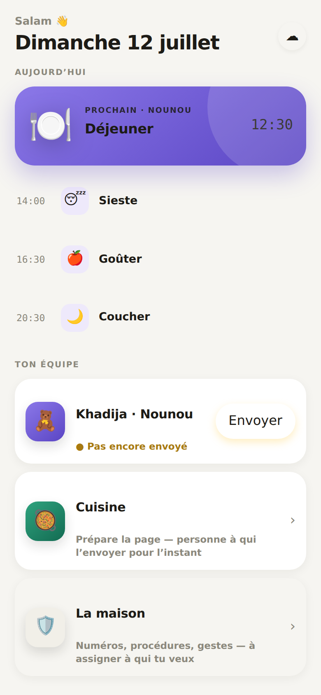
- **Rôle** : écran d'accueil. Bloc « Aujourd'hui » (prochain + timeline), « Ton équipe » (personnes réelles + cartes de rôle), « La maison » (Sécurité), « ＋ Une page pour quelqu'un d'autre ».
- **Accès** : ouverture de l'app.
- **Brief** : tout part d'ici. Une personne = un état = une action (pastille Envoyer / Briefer / Planifier, sinon chevron). Source : `src/maison/MaisonView.tsx`.

### 02 · Feuille « Une page pour… »
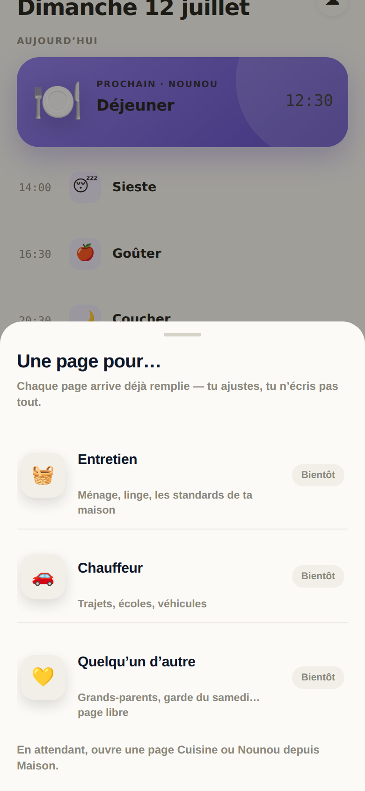
- **Rôle** : catalogue des futures pages de rôle (Entretien, Chauffeur, Quelqu'un d'autre) — toutes marquées « Bientôt ».
- **Accès** : Hub → bouton pointillé « ＋ Une page pour quelqu'un d'autre ».
- **Brief** : placeholder d'extension. Seules Cuisine et Nounou sont actives. Source : `src/App.tsx`.

### 03 · Compte & synchro
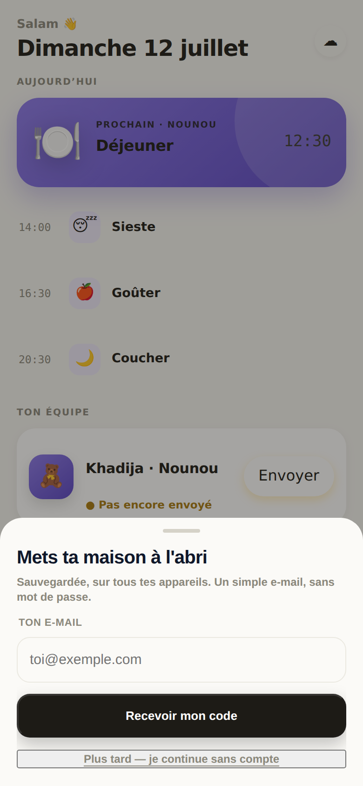
- **Rôle** : sauvegarde/synchro Supabase par lien magique (e-mail, sans mot de passe), export, réglages.
- **Accès** : Hub → avatar ☁︎ (haut droite).
- **Brief** : l'app marche 100 % offline ; ce compte n'est proposé que si Supabase est configuré. Source : `src/components/AccountSheet.tsx`.

---

## 1–2 — Cuisine (accent vert)

### 10 · Cuisine · Semaine
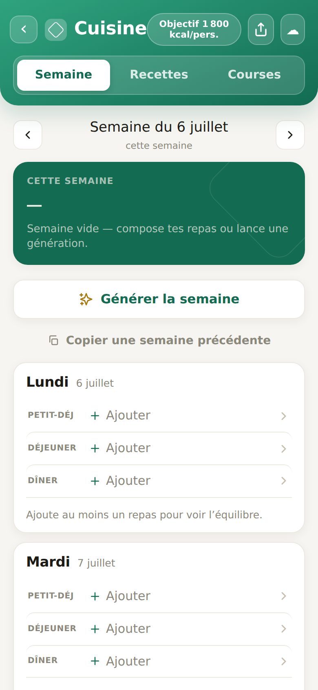
- **Rôle** : planning des 7 jours (petit-déj/déjeuner/dîner) + jauges kcal. **État initial vide** (« fresh install », aucun menu seedé).
- **Accès** : Hub → carte « Cuisine ».
- **Brief** : « Générer la semaine » consomme le quota IA **serveur** (Supabase réel) — non déclenché ici volontairement. Source : `src/cuisine/SemaineView.tsx`.

### 11 · Composeur de repas
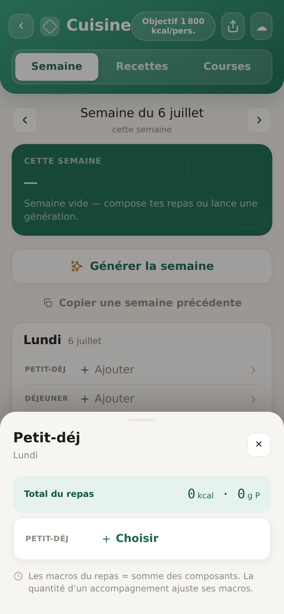
- **Rôle** : feuille de composition d'un repas (entrée / plat / accompagnement) + total macros.
- **Accès** : Semaine → tap sur un créneau de repas.
- **Brief** : macros du repas = somme des composants. Source : `src/cuisine/MealComposerSheet.tsx`.

### 12 · Sélecteur de recette
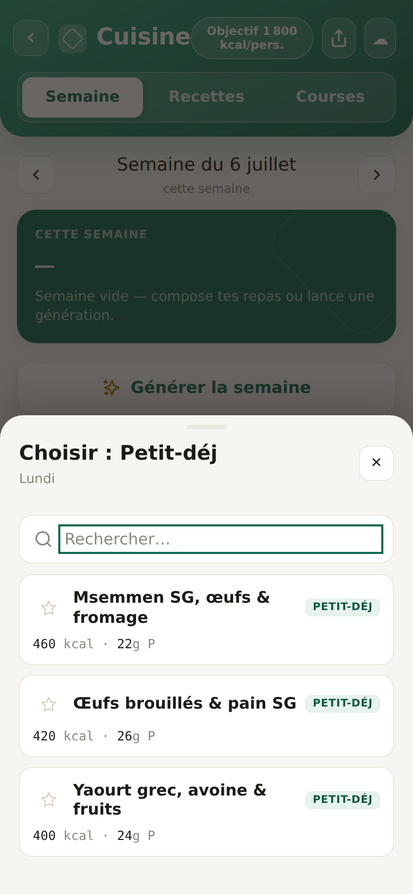
- **Rôle** : liste de recettes filtrée par rôle + recherche.
- **Accès** : Composeur → « Choisir » un composant.
- **Brief** : ⚠️ l'**image** est correcte (« Choisir : Petit-déj » + liste) ; le dump `innerText` dans `legende.txt` a capté la feuille sous-jacente. Source : `src/cuisine/RecipePickerSheet.tsx`.

### 13 · Bibliothèque
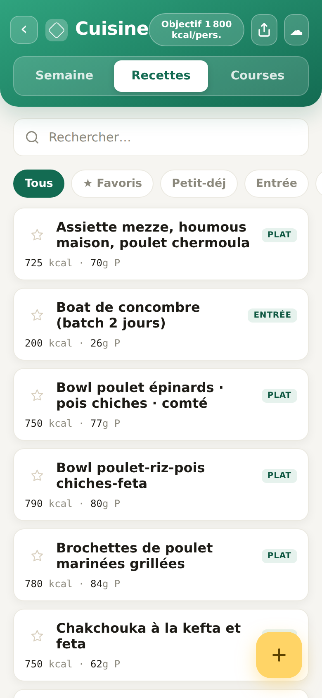
- **Rôle** : toutes les recettes (chips de rôle, favoris ★, macros, tags « À valider »), rail Collections en bas.
- **Accès** : Cuisine → onglet « Recettes ».
- **Brief** : ~30 recettes de démo seedées. Source : `src/cuisine/RecettesView.tsx`.

### 14 · Fiche recette
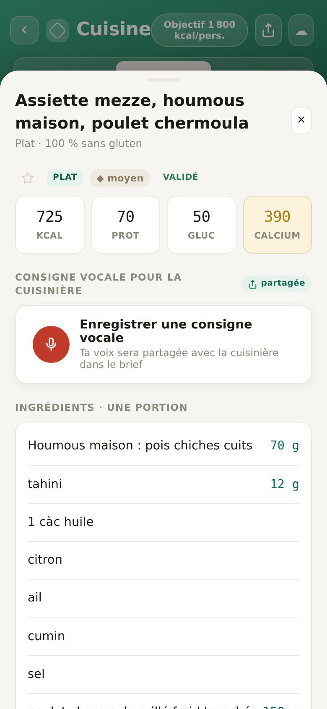
- **Rôle** : détail (kcal/prot/gluc/**calcium**, ingrédients par portion, consigne vocale, préparation).
- **Accès** : Bibliothèque → tap sur une recette.
- **Brief** : le **calcium** doit rester visible partout (invariant produit). Source : `src/cuisine/RecipeDetailSheet.tsx`.

### 15 · Ajouter une recette
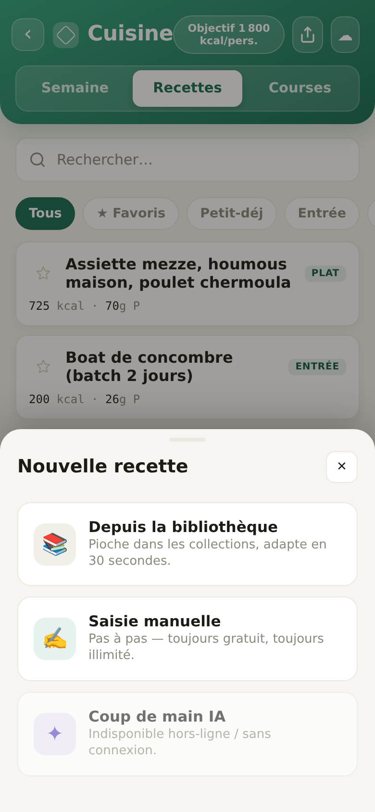
- **Rôle** : 3 voies — depuis la bibliothèque, saisie manuelle, coup de main IA (indisponible hors-ligne).
- **Accès** : Cuisine › Recettes → bouton flottant ＋.
- **Brief** : Source : `src/cuisine/AddRecipeSheet.tsx`.

### 16 · Collections
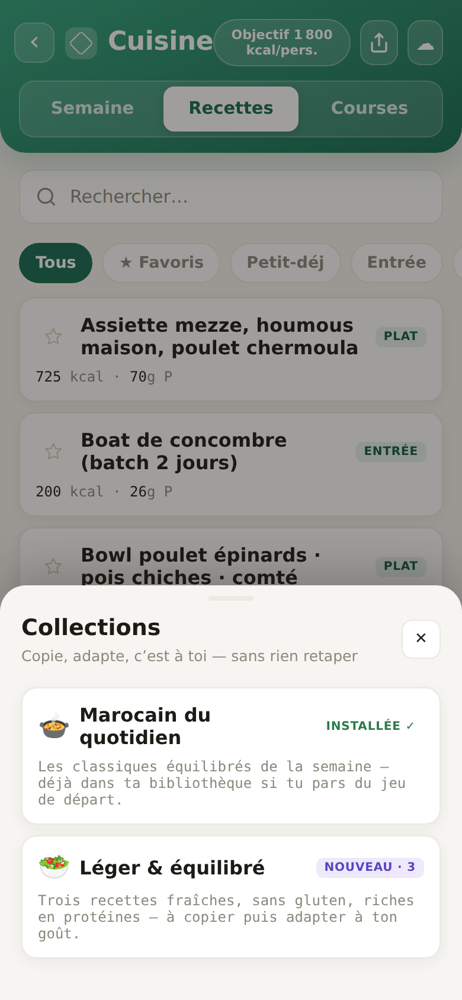
- **Rôle** : packs de recettes à **copier chez soi** (Marocain du quotidien, Léger & équilibré).
- **Accès** : feuille d'ajout → « Collections » (ou rail bas des Recettes).
- **Brief** : copie = appropriation, pas de lien vivant. Source : `src/cuisine/CollectionsSheet.tsx`.

### 17 · Courses (état vide)
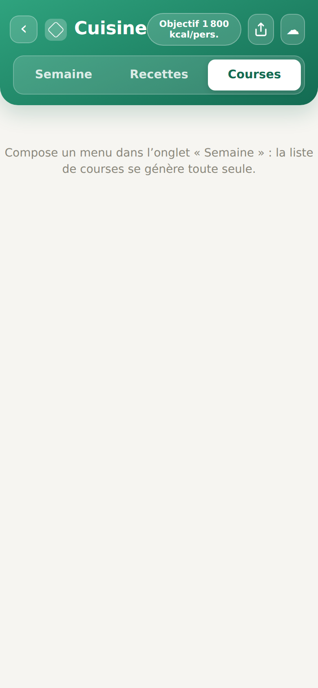
- **Rôle** : liste de courses agrégée depuis la semaine. **Vide** car aucun menu composé.
- **Accès** : Cuisine → onglet « Courses ».
- **Brief** : Source : `src/cuisine/CoursesCuisine.tsx`.

### 18 · Objectif kcal
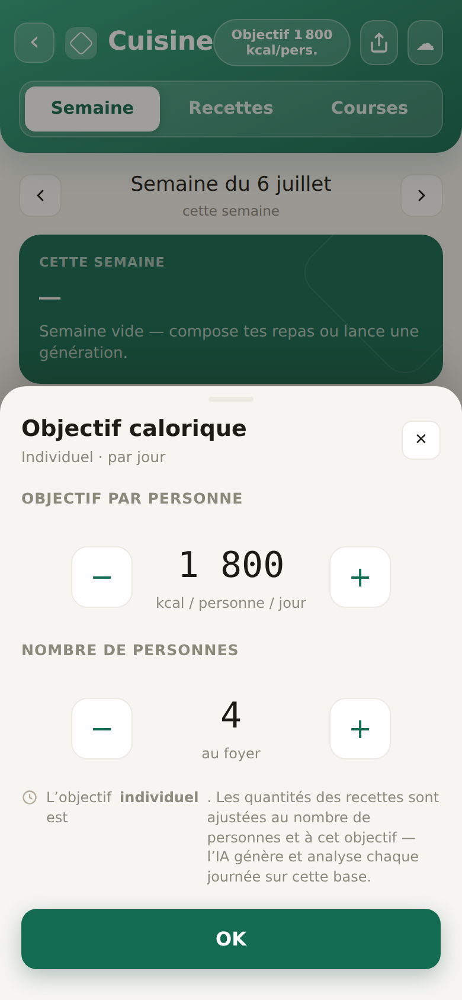
- **Rôle** : réglage objectif kcal/personne/jour + nombre de personnes au foyer.
- **Accès** : Cuisine → pastille « Objectif … kcal/pers. ».
- **Brief** : objectif **individuel** ; les quantités s'ajustent au nombre de personnes. Source : `src/cuisine/ObjectiveSheet.tsx`.

### 19 · Partager le menu
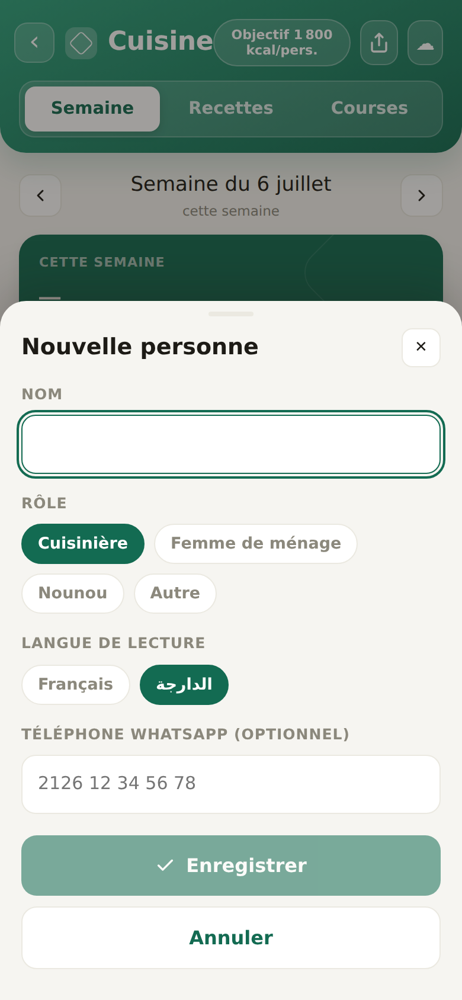
- **Rôle** : créer une page/lien pour un destinataire. **S'ouvre sur l'éditeur « Nouvelle personne »** (aucun destinataire enregistré au départ).
- **Accès** : Cuisine → icône ⤴.
- **Brief** : rôle, langue (FR / darija), téléphone WhatsApp. Source : `src/cuisine/PartageSheet.tsx`.

### 20 · Copier une semaine (état vide)
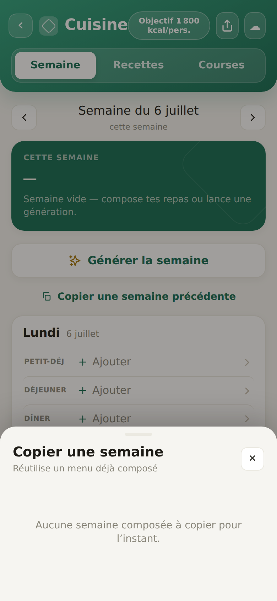
- **Rôle** : réutiliser un menu déjà composé. **Vide** : « Aucune semaine composée à copier ».
- **Accès** : Cuisine › Semaine → « Copier une semaine précédente ».
- **Brief** : Source : `src/cuisine/CopyWeekSheet.tsx`.

### 21 · Semaine suivante (état vide)

- **Rôle** : semaine sans repas (message « Semaine vide — compose tes repas… »).
- **Accès** : Cuisine › Semaine → chevron « Suivante ».
- **Brief** : montre l'état vide d'un jour/semaine. Source : `src/cuisine/SemaineView.tsx`.

---

## 3 — Nounou (accent violet · personne : Khadija)

### 30 · Nounou · Journée
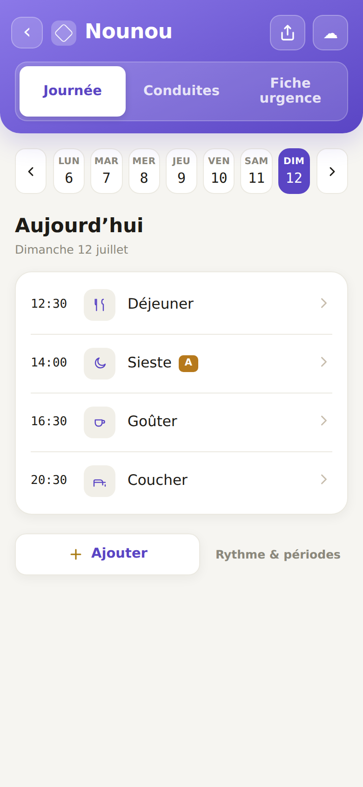
- **Rôle** : déroulé horaire du jour (bandeau période, événements, ponctuels), bandeau de dates en haut.
- **Accès** : Hub → carte « Khadija · Nounou ».
- **Brief** : Source : `src/nounou/JourneeView.tsx`.

### 31 · Conduites
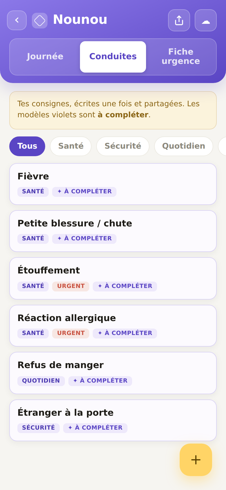
- **Rôle** : protocoles/règles (Santé, Sécurité, Quotidien), modèles violets « À compléter », marqueurs Urgent.
- **Accès** : Nounou → onglet « Conduites ».
- **Brief** : Source : `src/nounou/ConduitesView.tsx`.

### 32 · Fiche urgence
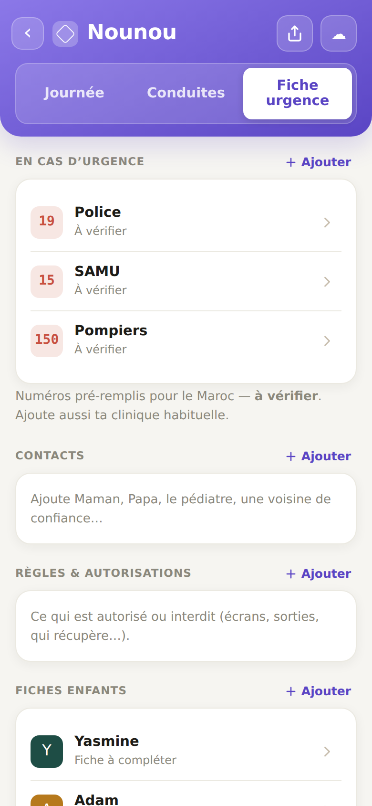
- **Rôle** : numéros d'urgence (pré-remplis Maroc, « À vérifier »), contacts, règles & autorisations, **fiches enfants** (Yasmine, Adam).
- **Accès** : Nounou → onglet « Fiche urgence ».
- **Brief** : Source : `src/nounou/FicheUrgenceView.tsx`.

### 33 · Partager la page Nounou
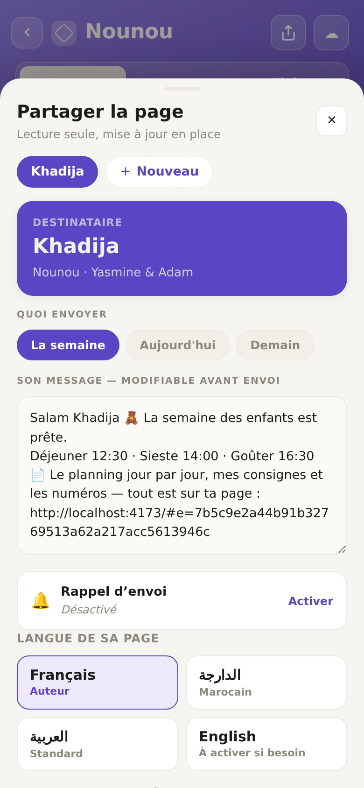
- **Rôle** : partage (destinataire Khadija pré-rempli), quoi envoyer, **langue/traduction** (FR / darija / arabe / anglais), enfants concernés, QR/lien.
- **Accès** : Nounou → icône ⤴.
- **Brief** : la page destinataire est lecture seule, mise à jour en place. Source : `src/nounou/PartageNounouSheet.tsx`.

---

## 4 — La maison / Sécurité (accent teal)

### 40 · Sécurité (état vide)
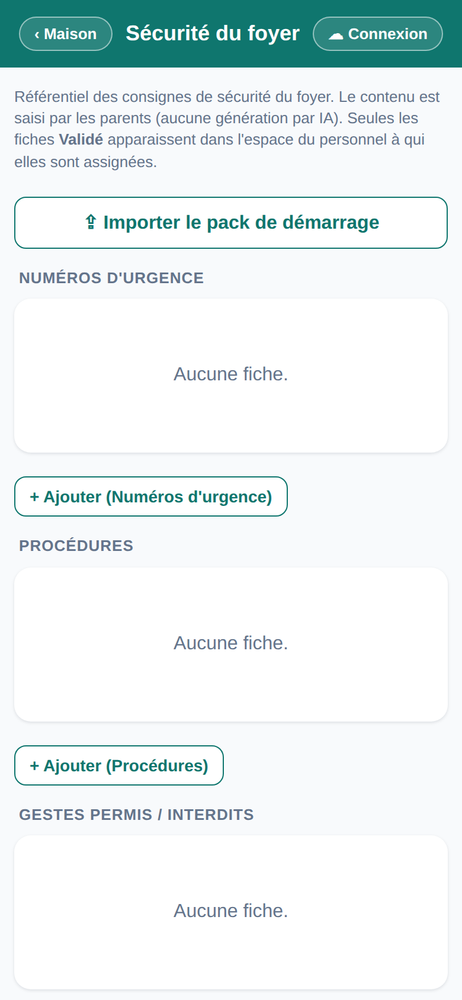
- **Rôle** : référentiel des consignes de sécurité **avant import** (sections vides).
- **Accès** : Hub → carte « La maison ».
- **Brief** : contenu saisi par les parents (aucune IA) ; seules les fiches **Validé** sont visibles au personnel. Source : `src/views/SecuriteView.tsx`.

### 41 · Sécurité (rempli)
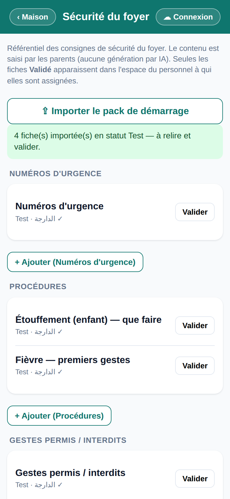
- **Rôle** : après « Importer le pack de démarrage » — fiches par section, statut **Test**, darija ✓, bouton **Valider**.
- **Accès** : Sécurité → « ⇪ Importer le pack de démarrage ».
- **Brief** : 4 fiches importées en statut Test à relire/valider. Source : `src/views/SecuriteView.tsx`.

---

## 5 — Espace destinataire (lien reçu par un tiers)

### 50 · Espace destinataire (vide/indisponible)
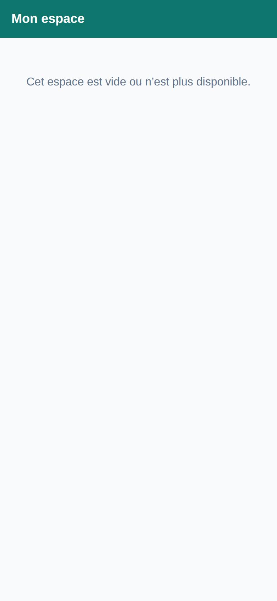
- **Rôle** : vue lecture seule ouverte via un lien `#e=<jeton>`. Ici **jeton invalide** → « Cet espace est vide ou n'est plus disponible. »
- **Accès** : ouverture d'un lien « Mon espace » avec un jeton factice.
- **Brief** : le rendu **plein** (semaine + fiches enfants) exige une publication Supabase réelle — voir « Non capturé ». Source : `src/views/EspaceView.tsx`.

---

## Non capturé (nécessite données/parcours réels)
- **Espace destinataire *rempli*** (`#e=<jeton valide>`) : exige une publication Supabase réelle (menu/nounou effectivement envoyés). Lire `src/views/EspaceView.tsx`.
- **Feuilles de saisie Nounou** : Ajouter période / protocole / événement / contact / numéro / enfant — accessibles mais non déroulées. Voir `src/nounou/*Sheet.tsx`.
- **QR code de partage** : bouton « Afficher le QR code » des feuilles de partage.
- **Vue `#m=` / `#p=`** (menu partagé hors-ligne compressé / publié) et `#mz-demo` (vitrine design system) — non parcourues.

## Notes de fidélité
- Semaine courante vide au 1er lancement = état réel « fresh install » (pas de seed de menu).
- `19` et `33` (partage) s'ouvrent sur un 1er état : `19` = création de destinataire (aucun encore) ; `33` = destinataire de démo déjà présent.
- Aucune capture n'a échoué ; aucune erreur console applicative (hors réseau/Supabase attendu).
